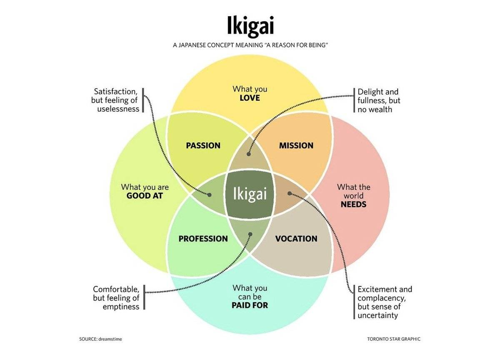

+++ 
draft = false
date = 2025-05-07T10:39:36+03:00
title = "About me"
slug = "about" 
+++

My name is Nikita Lanskov, and I’m from Saint Petersburg. I studied at Lyceum No. 144 and transferred to Lyceum No. 30 in the ninth grade. I consider this one of the best decisions I’ve made, as I have never encountered anything more advanced in terms of education and environment.

I completed my bachelor’s degree in Applied Mathematics at the Polytechnic Institute. I also enrolled in the master’s program there but did not defend my thesis.

My *ikigai* is to improve my life and the world around me by optimizing all processes that can be brought under control.

At work, I set up efficient CI/CD processes, automate routine tasks, visualize workflows, and structure them into a clear pipeline. In everyday life, I find the most joy in being prepared for any turn of events—when my potential energy is at its peak.
