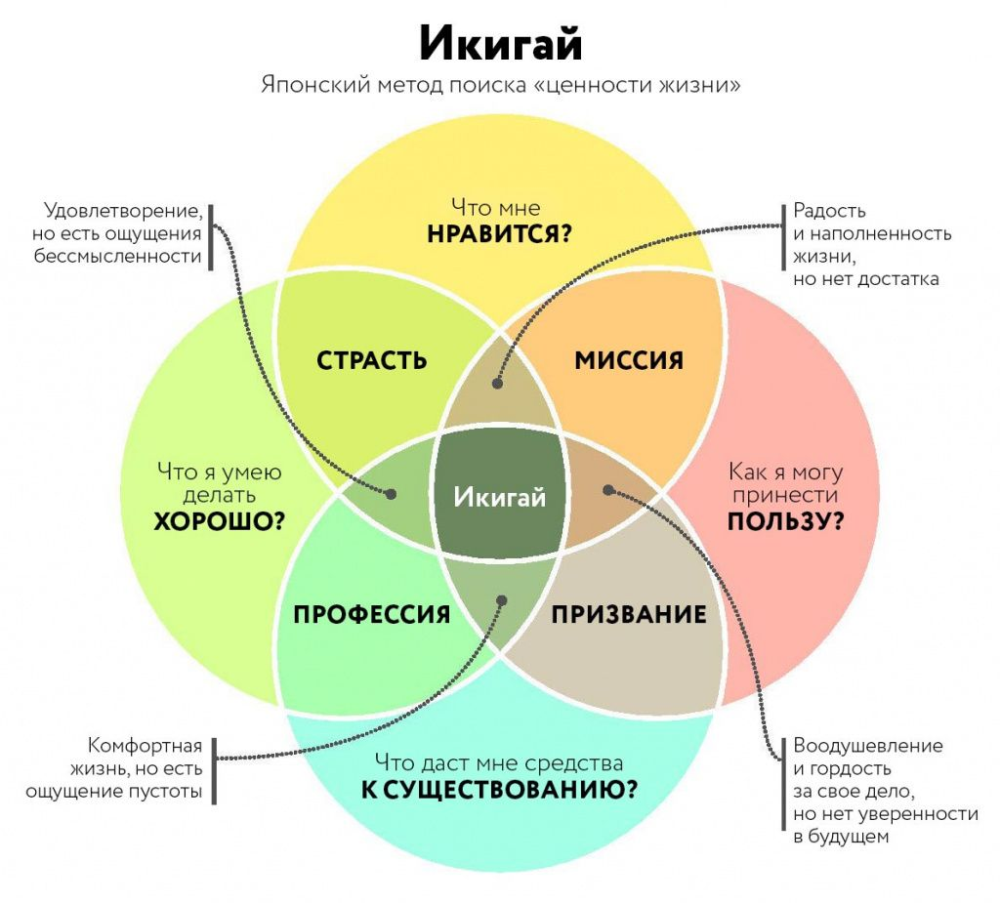

+++ 
draft = false
date = 2025-05-07T10:38:09+03:00
title = "Обо мне"
slug = "about" 
+++

Меня зовут Никита Лансков, я из Санкт-Петербурга. Учился в Лицее №144, в девятом классе перешел в 30 Лицей. Считаю это одним из лучших решений, так как по уровню образования и окружения ни с чем более продвинутым я в последствии не сталкивался.  

Закончил бакалавриат Политехнического института по направлению прикладной математики. Также отучился там же в магистратуре, но диплом не защищал. 

Мой икигай - улучшать свою жизнь и мир вокруг себя за счет оптимизации всех процессов, которые поддаются контролю.

На работе я настраиваю эффективные процессы CI/CD, скриптую рутину, визуализирую процессы и выстраиваю их в четкий пайплайн. В обычной жизни, наибольшее удовольствие я получаю, когда я готов к любым жизненным поворотам, когда моя потенциальная энергия на максимуме. 