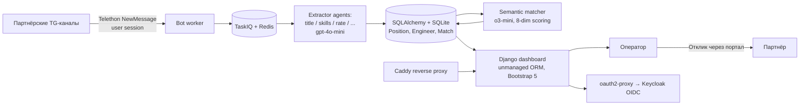

+++
date        = "2026-05-06T7:46:29+00:00"
slug        = "telethon-langchain-taskiq"
authors     = ["leins275"]
categories  = ["article"]
title       = "Telethon + LangChain + TaskIQ: внутренний AI-портал для аутстаффинга на одном VPS"
draft       = false
+++

> Версия для Habr

# Telethon + LangChain + TaskIQ: внутренний AI-портал для аутстаффинга на одном VPS

> Корпоративный материал ITS. Внутренний инструмент команды, делимся архитектурой без маркетинга и без выдуманных метрик.

## TL;DR

- Задача: автоматизировать обработку позиций из ~50 партнёрских Telegram-каналов и подбор инженеров из bench.
- Стек: SQLAlchemy + Alembic поверх SQLite, Django 5.1 (unmanaged-модели) для дашборда, Telethon (user-сессия, не Bot API), LangChain + OpenAI (`gpt-4o-mini` на экстракцию, `o3-mini` на reasoning-матчинг), TaskIQ + Redis на фоновые задачи, Caddy + oauth2-proxy + Keycloak.
- Бюджет на проде: один VPS за $10/мес, ~$30/мес на токены.
- Объём: ~1500 позиций и ~200 откликов в месяц через одного оператора вместо CEO.

Дальше — детали архитектуры, нюансы выбора моделей и ограничения, которые мы пока не закрыли.

## Контекст и задача

У нас аутстафф-направление: даём инженеров на внешние проекты партнёрам. Источник позиций — закрытые Telegram-каналы, где другие IT-компании постят роли, которые не закрыли своими силами.

До автоматизации процесс держался на одном человеке (CEO): он мониторил ленту, держал в голове состав bench, сам сопоставлял позиции с инженерами и отвечал партнёрам в личку. На пиках поток позиций обгонял оператора, и часть просто пропускалась.

Жёсткие ограничения, с которыми проектировали:

- **Минимум инфраструктуры.** Это внутренний инструмент, не продукт; обслуживать Kubernetes ради него мы не собираемся.
- **Финальное решение — за человеком.** B2B-коммуникация: ложноположительный отклик дороже пропущенной позиции.
- **Прозрачность скоринга.** Каждое решение модели объяснимо, чтобы оператор за 5 секунд понимал, согласен он с ней или нет.

## Что рассматривали и почему отбросили

**Bot API.** Очевидное первое решение. Не подошло: в большинстве партнёрских чатов бот не имеет прав на чтение истории, а пригласить его требует разрешения админа. Telethon с user-сессией таких ограничений не знает.

**Регулярки и эвристики на экстракции.** Тестировали на выборке. Базовые поля (название роли, грейд) — точность ~70%, составные (требования, длительность, локация в свободной форме) — резко падает. Edge-кейсы съедают ровно столько времени оператора, сколько мы хотели сэкономить.

**Эмбеддинги + cosine similarity для матчинга.** Дёшево, но проигрывает на нюансах: "5 лет коммерческого Go" против "разработчик с pet-проектом на Go" эмбеддинги ставят слишком близко. Для нашего домена это много false positives на дорогих позициях.

**LLM-only архитектура (одна большая модель на всё).** Дорого и медленно. Экстракция структурированных полей — задача на дешёвую модель, reasoning-матчинг — на дорогую. Смешивать — дороже без выигрыша в качестве.

В итоге архитектура — двухконтурная: набор узкоспециализированных дешёвых экстракторов на `gpt-4o-mini` плюс один reasoning-агент на `o3-mini` для матчинга свежих позиций.

## Архитектура



Ниже — по компонентам.

### Telethon-воркер

User-сессия Telethon, подписка на `events.NewMessage(incoming=True)` для списка каналов из конфига. Каждое новое сообщение нормализуется, кладётся в БД и порождает фоновую задачу TaskIQ на экстракцию.

```python
client = TelegramClient(SESSION_PATH, API_ID, API_HASH)

@client.on(events.NewMessage(incoming=True))
async def on_message(event):
    raw = await store_raw_message(event)
    await enqueue_extraction.kiq(raw_id=raw.id)
```

Из неприятного:

- **FloodWaitError.** Telethon отдаёт исключение с указанием паузы. Без обработки воркер на старте теряет offset; с обработкой — просто ждёт и продолжает с того же места. Стандартная история для любого MTProto-проекта.
- **Сессии.** `.session`-файл хранится локально и привязан к API_ID/API_HASH. Бэкап обязателен — потеря файла означает повторную авторизацию через SMS.
- **MessageEdited мы пока не обрабатываем.** Партнёры иногда правят сообщение через 5–30 минут после публикации (добавляют ставку, контакт). Это в TODO; сейчас покрытие — только новые сообщения.

### Экстракция: набор узких агентов на gpt-4o-mini

Здесь reasoning не нужен. Вместо одного "большого" экстрактора у нас набор специализированных агентов под отдельные поля и аспекты позиции — каждый со своим промптом и температурой 0.0:

- `TITLE_EXTRACTOR` — нормализованное название роли;
- `SKILLS_EXTRACTOR` — primary/secondary стек, с разделением "требуется" vs "упомянуто";
- `RATE_EXTRACTOR` — ставка, валюта, период (час/день/месяц);
- `EXT_POSITION_ID_EXTRACTOR` — внешний ID, если партнёр его указывает;
- ещё несколько на category, payment_conditions, experience и пр.

Все промпты собраны в одном модуле (`src/infrastructure/ai/constants.py`), что упрощает их версионирование и сравнение версий. Через LangChain (`ChatOpenAI` + соответствующий output-парсер) каждый агент получает только релевантный кусок текста и возвращает строго заданное поле.

Паттерн "много мелких агентов вместо одного большого" даёт две вещи:

- **Фокус.** Промпт каждого агента короткий и обозримый; легко править, не ломая остальные.
- **Стоимость.** На уровне отдельных полей чаще достаточно дешёвой модели, и общий счёт за токены остаётся в пределах десятков долларов в месяц на наш объём.

Ценой — оркестрация: нужно следить, что все экстракторы прошли, и собрать результат в единую сущность `Position` (dataclass на стороне домена).

### Матчинг: o3-mini с 8-dimension scoring

Сюда уходит только то, что прошло экстракцию и помечено как валидная позиция. Матчинг делается раз — при создании позиции; при изменении CV пересчитывается батчем.

Системный промпт матчера — один из самых длинных в проекте. Вместо короткого "найди подходящих" мы прописали взвешенную модель оценки по 8 измерениям с явными весами и MANDATORY RULES:

| Dimension | Вес |
|---|---|
| job_title_alignment | 25% |
| skills_technical | 25% |
| rate_compatibility | 20% |
| location_match | 15% |
| seniority_level | 8% |
| domain_experience | 4% |
| soft_requirements | 2% |
| culture_fit | 1% |

И жёсткие "предохранители" в самом промпте, например:

> If `job_title_alignment` < 0.5 → `overall_match_score` MUST be < 0.6.
> If `skills_technical` < 0.4 → `overall_match_score` MUST be < 0.5.
> If `rate_compatibility` < 0.3 → recommendation MUST NOT be "strong_match".

Такие правила нужны, потому что reasoning-модели охотно компенсируют слабое попадание по одному критерию за счёт сильного по другому. Мы хотим, чтобы критичные несовпадения (роль, стек, бюджет) ограничивали финальный балл сверху.

На выходе матчер возвращает (через LangChain) словарь с полями `overall_match_score`, `recommendation`, `dimension_scores`, `strengths`, `concerns`, `verdict`, `interview_questions`. Намеренно не оборачиваем в Pydantic-модель: на текущем этапе нам важнее видимость "почему" (свободный текст в `concerns`/`strengths`), чем строгий контракт.

Несколько наблюдений:

- **`o3-mini` vs более дешёвые модели.** Тестировали GPT-4o-mini как кандидата на матчинг — точность падает на нюансах вроде "человек 2 года писал на Go, остальное — Python; подходит на Senior Go?". Разница в стоимости — порядка $0.05–0.10 на матчинг — на 200 откликов/мес это считаные доллары.
- **Reasoning visible.** За счёт `concerns`/`strengths` оператор видит логику, не открывая логи. Это сильно ускоряет ревью.
- **MANDATORY RULES в промпте — необязательны, но дисциплинируют модель.** Без них видели "score 0.78 при job_title_alignment 0.3" — модель находила красивые объяснения.

### Хранение и Django-дашборд

Самая скучная часть. Production-данные пишутся через **SQLAlchemy + Alembic**: миграции, типобезопасный domain-слой, никакой Django ORM на write-пути. `outstaff.db` — SQLite в WAL-режиме. На наш объём (БД меньше гигабайта, один воркер на запись) этого хватает с запасом; на масштабе мигрируем в Postgres за вечер.

Поверх той же базы поднят **Django 5.1 dashboard** — но через unmanaged-модели, которые отзеркалены 1-в-1 со схемой SQLAlchemy. Это компромисс: мы получили готовый Django admin и шаблоны на Bootstrap 5, не дублируя миграции и не создавая два источника правды для схемы. На уровне dashboard через Django ORM делается и чтение, и часть пользовательских действий оператора.

Главный экран — список свежих позиций с топ-кандидатами, скором по 8 измерениям, рисками и кнопками "одобрить и отправить" / "отклонить" / "переподобрать". Все действия логируются в отдельную таблицу — это даёт и аналитику по каналам, и аудит.

### Фоновые задачи: TaskIQ + Redis

Очередь — **TaskIQ**. Расклад брокеров: Redis на проде, InMemoryBroker как fallback для локальной разработки и тестов. Все долгие операции (экстракция нового сообщения, переподбор по позиции, фоновая переоценка bench) — через `@broker.task`.

Главное правило: ничего не теряем. Сырое сообщение сохраняется до любой обработки. Если экстракция упала — задача перезапустится; если матчинг упал — позиция остаётся со статусом `awaiting_match` и попадает в следующий батч.

### Деплой и доступ

Один VPS, Docker Compose, Caddy как reverse proxy и автоматический TLS. Аутентификация в дашборд — через **oauth2-proxy → Keycloak (OIDC)**: команда логинится корпоративным SSO, отдельных паролей под Django нет.

Entry-point у проекта — кастомный `manage.py` с подкомандами:

```bash
python manage.py bot         # Telethon-воркер
python manage.py dashboard   # Django + Gunicorn на :8501
python manage.py django <…>  # проброс штатных Django-команд
```

Это намеренно тонкий слой, чтобы один и тот же образ запускался в трёх ролях (бот, дашборд, миграции) по разным `command:` в docker-compose.

## Подводные камни

**1. Промпт-управление расползается.** При наборе из десятка экстракторов соблазн править их по месту, потом ловишь регрессии в полях, которые "вроде не трогал". Помогло — собрать все промпты в один модуль (`src/infrastructure/ai/constants.py`) и завести правило: правки промптов через MR, как код.

**2. CV-база — главное узкое место.** Модель хороша ровно настолько, насколько структурирована информация об инженерах. Половина усилий следующего квартала — разметка bench-профилей: явные теги по стеку, история фидбека от партнёров, доступность.

**3. Стоимость растёт нелинейно с bench.** В матчинг-промпт сейчас идут компактные описания всех доступных инженеров. На нашем размере это работает; на 100+ упрётся в context window и подорожает. Двухступенчатая схема (эмбеддинги → o3-mini) в плане, но не в проде.

**4. SQLite — не навсегда.** Сейчас работает. Дашборд читает через Django ORM, бот пишет через SQLAlchemy, конкуренция минимальна, WAL держит. Когда упрёмся — Postgres за вечер.

**5. Нет полной автоматизации отклика — и это сознательно.** В B2B цена ложноположительного отклика выше, чем выигрыш в скорости. Финальный шаг всегда у оператора, и менять это мы не планируем.

## Результаты

| Метрика | До | После |
|---|---|---|
| Кто держит процесс | CEO | Один оператор |
| Покрытие чатов | ~30 каналов вручную | ~50 каналов автоматически, 24/7 |
| Объём в месяц | "сколько успел" | ~1500 позиций, ~200 откликов |
| Прямые расходы на сервис | — | $10 хостинг + ~$30 токены = ~$40/мес |
| Размер кодовой базы | — | ~10 300 строк Python + ~1 800 HTML/JS |

Цифры по точности матчинга мы пока не публикуем — внутренние замеры есть, но методология не готова к внешнему обсуждению. Правило простое: метрика без замера — не метрика.

## Что дальше

- **Двухступенчатый матчинг** (эмбеддинги → `o3-mini`) для масштабирования по bench.
- **Подписка на `events.MessageEdited`** + дедупликация по `(channel_id, message_id)`. Партнёры регулярно правят сообщения, мы это пока теряем.
- **Сбор фидбека от инженеров** после интервью с партнёром — главный сигнал, которого сейчас матчеру не хватает.
- **Дедупликация позиций между каналами**: одна и та же роль часто появляется в 3–4 чатах; хочется матчить и показывать как одну запись.

## Когда такой подход НЕ работает

Чтобы не звучало как "стройте AI-агентов везде":

- **Цена ошибки высокая, а human-in-the-loop недоступен** — не делайте. Авто-действие в B2B без оператора — стабильно плохая идея.
- **Входные данные хорошо структурированы.** ATS со стандартными формами вакансий не нуждаются в LLM-экстракции — добавите шум и стоимость.
- **Объём — десятки сообщений в день.** Ручная работа дешевле инфраструктуры.
- **Матчинг строится на жёстких правилах** (точное совпадение сертификатов, лицензий) — LLM добавит шума, а не точности.

В ITS мы обычно начинаем такие внутренние и клиентские проекты с разметки процесса по этим четырём вопросам — раньше выбора стека или модели. Большая часть "это нельзя автоматизировать" на проверке оказывается "это можно автоматизировать, если оставить финальное решение за человеком" — что сильно меняет картину.

## FAQ

**Зачем LangChain, если можно дёргать OpenAI SDK напрямую?**
Прежде всего — единый интерфейс для десятка агентов и удобный output-парсинг. Цепочки агентов и tool-calling здесь не используются. Если бы стартовали сегодня с нуля — возможно, обошлись бы Pydantic AI или нативным `response_format` SDK; на момент сборки LangChain был быстрее в интеграции.

**Почему Django, если основной слой данных — SQLAlchemy?**
Нужен был дашборд с минимальным фронтенд-усилием. Django + admin + готовые шаблоны на Bootstrap покрыли это за день. Чтобы не поддерживать две схемы, Django-модели отражают SQLAlchemy-схему как unmanaged. Единая истина — миграции Alembic.

**Зачем TaskIQ, а не Celery?**
TaskIQ нативно async, и это лучше ложится на async-Telethon-воркер. Для нашего объёма разница не критическая, но ради единого стиля кода взяли TaskIQ. На прод-broker'е (Redis) поведение предсказуемое.

**Как обходим Telegram TOS для user-аккаунтов?**
Никак не обходим. Telegram явно разрешает автоматизацию через Telethon/MTProto при выполнении общих rate limits и ToS. Партнёрские чаты — это закрытые сообщества, в которые мы приглашены как участники.

**Почему 8 dimensions, а не 3 или 20?**
Эмпирически. На 3 модель упускает важные ограничения (бюджет, локация). На 20 — устаёт и начинает "усреднять" в районе 0.5–0.7 для всего. 8 с явными весами и MANDATORY RULES оказались точкой, где модель ведёт себя предсказуемо.

**Можно ли заменить o3-mini на Claude/DeepSeek?**
Архитектурно — да, это смена 1–2 строк через LangChain. Главное — повторно прогнать промпт матчера на отложенной выборке, потому что MANDATORY RULES чувствительны к тому, как конкретная модель интерпретирует "MUST" в инструкциях.

---

*Материал подготовлен командой ITS — мы помогаем компаниям внедрять AI-агентов и автоматизацию в реальные бизнес-процессы. Если у вас есть похожая задача и вы прикидываете, стоит ли её брать в работу — можно обсудить.*

[its.xyz](https://its.xyz/?utm_source=habr&utm_medium=pr_article&utm_campaign=ai_automation_pr&utm_content=django_telethon_langchain_ai_portal) · [Telegram](https://t.me/savchuda) · [WhatsApp](https://api.whatsapp.com/send/?phone=351930495062&text&type=phone_number&app_absent=0) · [Max](https://max.ru/u/f9LHodD0cOJLC4bLSV6sPqrZpJlEw-Vamk2GphtnpvQVwU2fH5N5vY5DN98) · [presales@its.xyz](mailto:presales@its.xyz) · [LinkedIn](https://www.linkedin.com/in/savchuda/)
