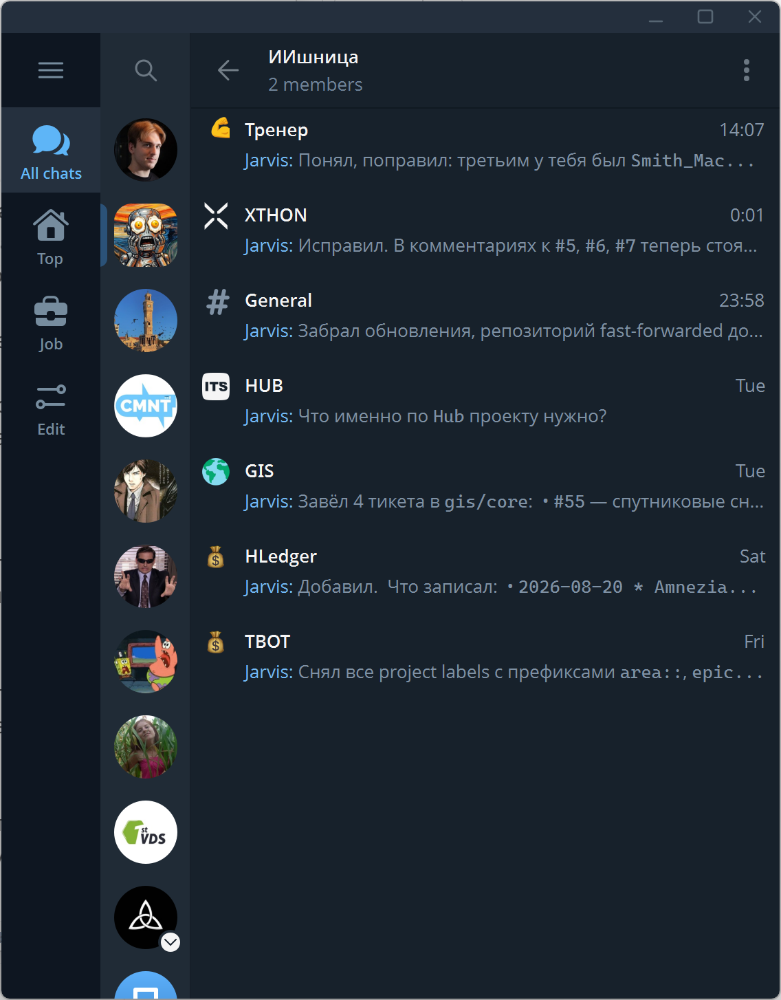
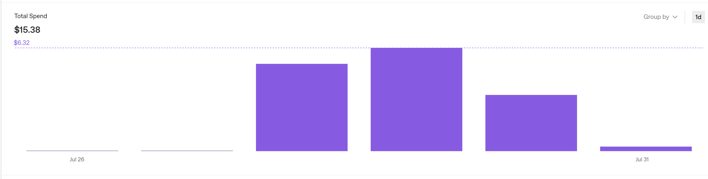
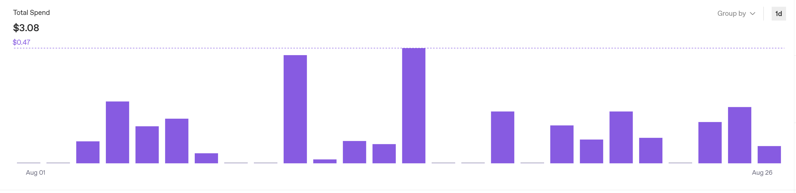

OpenClaw уже как будто даже вне хайпа. Сейчас уже всякие новые Гермесы и другие агенты в моде. Но я только в конце июля наконец увидел для себя толк от этого опенкло, настроил и с тех пор пользуюсь.

В этой статье мини отчет про мой опыт.

## Настройка окружения

Изначально OpenClaw продвигается как локальное решение. Запускать его у себя локально я, конечно, не захотел. Поэтому у меня он работает на VPS. Плюсов у этого сразу несколько. Во-первых, какая-никакая изоляция. Во-вторых, доступность 24/7, а не только когда я у компа.

Конфигурирую я это все дело при помощи Claude Code, куда же без него. На гитхабе у меня два приватных гит репозитория. В первом — ансибл для настройки VPS под опенкло и сам опенкло сетап. Во втором репозитории у меня конфиги воркспейсов. Про них расскажу далее по тексту.

## Интерфейс

У опенкло есть много способов взаимодействия с ним. По умолчанию это гейтвей, и вы можете взаимодействовать с агентом через чат в браузере, или, например, через CLI.

Но для этой игрушки это неспортивно. Поэтому первым же делом, чтобы оно было юзабельно, мы настраиваем интеграцию с телеграм-ботом.

Но и это не предел. У меня почти сразу возникла необходимость разделять контексты. Для этого отлично подходит телеграм-группа. Сейчас у меня оно выглядит как-то так. Группа в телеграме, с двумя участниками — я и мой бот. В группе — отдельный топик под каждую задачу (тему), которую я решаю.

## Мои юзкейсы

### 1. Прокси между чатами и таск-трекером

В первом юзкейсе у меня настроено сразу несколько рабочих проектов. По каждому проекту есть отдельный тред в телеграм-группе. Идея следующая. У меня настроены интеграции с телеграмом, с гугл-чатом, а также с гитлабом по API. И мой агент умеет собирать информацию из чатов и переносить ее в гитлаб-ишьюсы, например.

### 2. Личный тренер

Если вы тренируетесь ради результата — пожалуй, вам нужен персональный тренер. Мои тренировки — это силовые по 30–40 минут 2 раза в неделю в зале без изысканных тренажеров. Главные ценности — это регулярность и снижение внутреннего сопротивления походу в зал.

Я скачал из открытых источников базу упражнений, загрузил свои параметры, и теперь агент выдает мне план на следующую тренировку и ведет учет результатов.

Еще раз, для меня главная ценность — отсутствие сопротивления походу в зал. Я не думаю, что буду делать сегодня, за меня решает «рандомайзер».

### 3. Интерфейс для hledger

Существует много разных крутых приложений, которые работают из командной строки. Например, недавно я перешел на hledger из экселя для учета личных финансов.

Главный недостаток таких программ — это довольно тяжелый интерфейс. Как минимум, нужно знать, какие бывают команды, и придерживаться определенного формата.

При помощи агента я могу не думать про формат, а описывать расходы и запросы своими словами. Агент знает синтаксис команд еще с обучения, а если не знает — умеет грепать ман-страницы.

## Что по деньгам

Крутится это все у меня на сервере 2x4. Возможно, это можно запускать и на более слабом железе. Я покупаю VPS, но в принципе можно захостить и дома, например на старом ноуте. Будет вообще бесплатно.

По токенам. Я использую OpenAI. По началу расход был жесткий, примерно 5 баксов в день. Это неприемлемо. Но после тонкой настройки стало хорошо. Да, я не использую крутые модели, но для моих задач они и не требуются.

Вот расход до оптимизации — 15$ за 4 дня не особо активного использования.

А вот это — после. 3 бакса за 26 дней августа.

