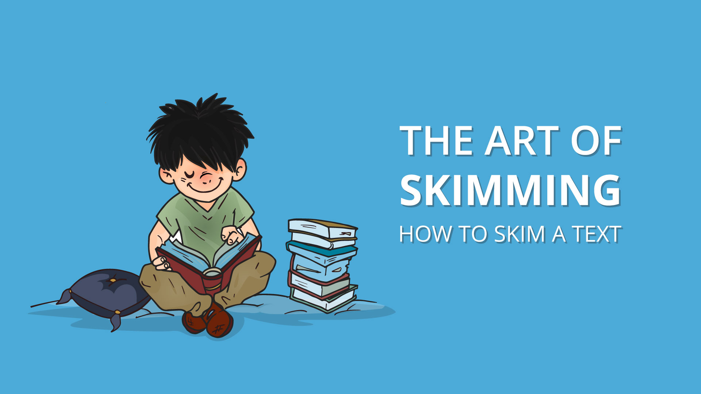

+++ 
draft = false
katex = false
authors = ["leins275"]
date = 2023-03-20T15:41:50+03:00
title = "Скимминг"
description = "Как выжимать знания из книг. Быстро, точно, надежно."
categories = ["article"]
slug = "skimming"
tags = ["itstime"]
series = ["по теме: Чтение"]
images = ["https://leins275.xyz/posts/skimming/img/skimming.jpg"]
+++

В прошлый раз я описывал два метода чтения в заметке об изучении языка. Хочется немного развить эту тему.
У меня довольно много нон-фикшн книг в списке на почтитать. И при этом копятся в списке на чтение они гораздо быстрее, чем я их читаю, думаю многим это знакомо.
Так вот. Если подходить к процессу чтения более осознанно, то можно значительно ускорить процесс обработки полезной информации, и даже повысить его качество. В этом в значительной степени может помочь такой метод чтения, как скимминг.
Skimming - процесс сбора сливок, если переводить дословно. Метод основан на том, что большинство нон-фикшн книг написаны циклично. Во введении обычно поставлен вопрос, на который отвечает книга. В заключении - общий вывод из всех аргументов книги, ответ на поставленный вопрос. В начале главы - описание темы, в конце - выводы. В начале абзаца - проблема, в конце - решение. Ну, вы поняли. Понимание структуры построения книги позволяет более рационально подходить к ее изучению.
# Как читать скиммингом?
Если вы хотите читать скиммингом, то нужно придерживаться следующих подходов:
## Задать себе вопросы и формулировать цели перед чтением
- О чем книга?
- Как эта книга может вам помочь?
- Как информация из книги коррелирует с тем, что вы уже знаете?
- Что вы хотите узнать из этой книги?
## Первый шаг - прочитать введение и заключение
При знакомстве с книгой вы сначала читаете введение и заключение. Внимательно. Это позволяет вам сразу оценить, о чем книга, соответствует ли она вашим ожиданиям и целям.
## Работа с оглавлением. Нелинейность чтения
После введения и заключения, вы не бросаетесь читать все подряд. Сначала также внимательно изучаете оглавление. Выделяете для себя, какие из глав для вас представляют наибольший интерес, а какие в целом понятны и без прочтения. Понятно, что мы хотим подчеркнуть только важное и новое для себя, вычленить концентрированную суть.
## Читать с разной скоростью
Когда вы выбрали из оглавления какие-то ключевые моменты, то можете переключиться на их чтение. При этом помним, что мы не просто читаем, а снимаем сливки смыслов! В каждом абзаце мы внимательно читаем начало и конец абзаца. При этом, если суть абзаца тривиальна или очевидна, можно его быстро пробежать глазами. Если смысл начинает теряться - продолжаем читать внимательно. Короче, меняем скорость и концентрацию при чтении в зависимости от того, насколько нам понятно и интересно. Тут важно то, что мы прокачиваем навык дополнять и додумывать мысль за автора, частично погружая ее в свои контексты, что делает ценнее всю новую информацию.  
# Для разных целей - свой подход
Скимминг хорошо подходит для чтения нон-фикшн литературы. Когда вы хотите узнать что-то новое, или проводите какую-то научно-исследовательскую работу. 
При этом художественную литературу так читать не нужно. Для этого гораздо лучше подойдет подход экстенсивного чтения. 
В общем, в зависимости от того, какую цель вы ставите перед собой и перед чтением какой-то книги, будет зависеть, как лучше всего подходить к чтению.
# Ссылки 
Про метод чтения скиммингом я узнал из курса [Рустама Агамалиева](https://rustamagamaliev.ru). 

Также оставлю пару ссылок про скимминг и чтение:
- [Четыре техники чтения](https://4brain.ru/blog/%D1%87%D0%B5%D1%82%D1%8B%D1%80%D0%B5-%D1%82%D0%B5%D1%85%D0%BD%D0%B8%D0%BA%D0%B8-%D1%87%D1%82%D0%B5%D0%BD%D0%B8%D1%8F/)
- [Skimming](https://learningcenter.unc.edu/tips-and-tools/skimming/)

