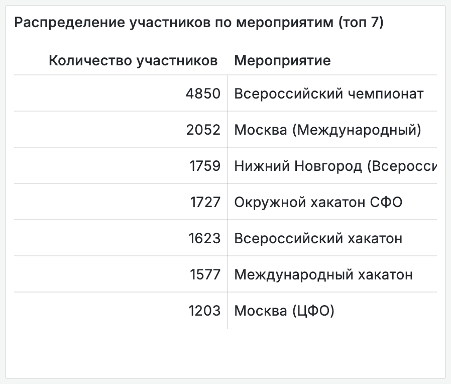
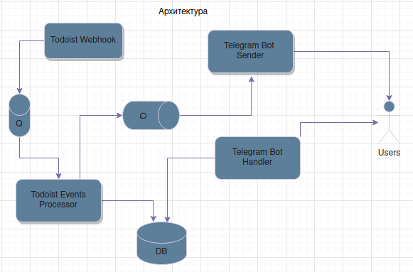
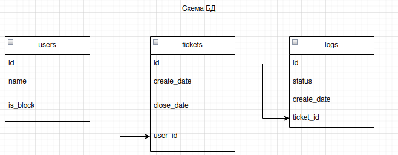

+++ 
draft        = false
title        = "Бот техподдержки"
description  = "Бот для упрощения работы техподдержки"
client       = "ITS"
skills = ["Python", "aiogram", "FastAPI", "Docker", "PostgreSQL", "sqladmin"]
roles        = ["Project manager", "Business analyst", "Team Lead", "DevOps"]
start        = "Ноя 2023"
end          = "Фев 2025"
date         = 2025-05-08T08:34:09+03:00
+++

Во время работы над цифровой платформой мы с командой оказывали техническую поддержку организаторам мероприятий. С ростом числа обращений стало ясно, что процесс необходимо автоматизировать, чтобы разгрузить поддержку и упростить коммуникацию для пользователей.

Для этой цели был разработан телеграм-бот, интегрированный с Todoist по API. Он позволил централизовать обращения, ускорить их обработку и масштабировать команду поддержки.

## 📈 Ключевые результаты
Бот использовался активно с ноября 2023 по февраль 2025 года. Через него было поддержано 10 хакатонов Цифрового Прорыва, включая один всероссийский и один международный.

До внедрения бота поддержкой занимался один опытный агент, на которого приходились все обращения. С помощью бота мы масштабировали команду до трёх агентов, снизили нагрузку на ключевого специалиста и обеспечили высокую доступность поддержки благодаря равномерному распределению заявок и взаимопомощи в команде.

> Данные подтверждены выгрузкой из базы данных бота и статистикой платформы xthon.

Потенциал для развития:

В отличие от традиционных helpdesk-систем, ориентированных на e-mail, телеграм-бот обеспечивает более живую, интерактивную и адаптивную поддержку в реальном времени. Это делает его особенно эффективным для интенсивных мероприятий вроде хакатонов, и мы рассматриваем возможность расширения функциональности и открытого распространения решения.

## 🏗 Архитектура решения и процесс разработки
Я выступал инициатором и координатором проекта: разработал концепцию, спроектировал архитектуру, собрал команду, вывел решение в продакшн и внедрил его в процессы службы поддержки. Также на мне была настройка CI/CD как главного DevOps-инженера компании. Кроме меня над проектом работал бэкенд инженер, который реализовал большую часть функциональности. 

Ключевые элементы архитектуры:
- Организаторы обращаются через телеграм-бота, получают уведомления и видят свои запросы в одном месте.
- Агенты поддержки получают уведомления о новых обращениях и самостоятельно берут заявки в работу (вытягивающая модель).
- Все тикеты создаются в Todoist — агенты работают с ними через доску задач.
- Поддерживается двусторонняя коммуникация через комментарии в тикетах: пользователь пишет в Telegram, агент отвечает через Todoist.

Процесс разработки:
- Использовался гибкий подход с быстрыми итерациями.
- Инфраструктура и деплой автоматизированы через CI/CD пайплайн.
- Взаимодействие с API и БД реализовано полностью асинхронно.

## ⚙️ Детали реализации, особенности и сложности
- Бот реализован с полной асинхронной обработкой внешних запросов: API Telegram, API Todoist и взаимодействие с БД.
- В процессе внедрения был разработан и внедрён набор внутренних регламентов и скриптов для команды поддержки.
- Одной из особенностей стало использование телеграма как основного интерфейса, что позволило сохранить контекст и удобство общения без переключения между инструментами.
