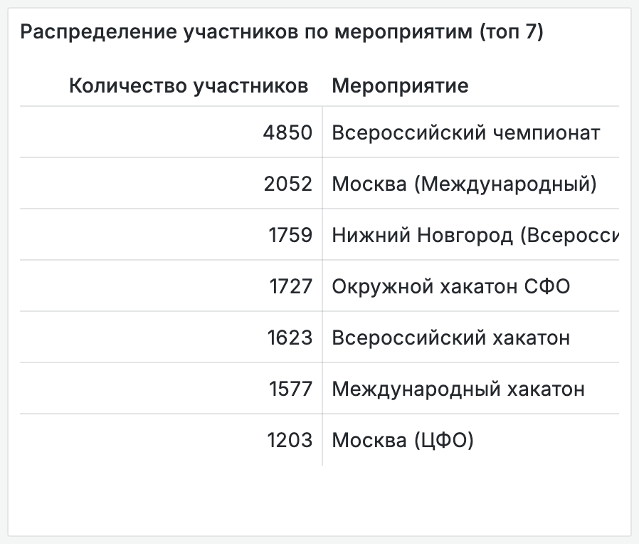
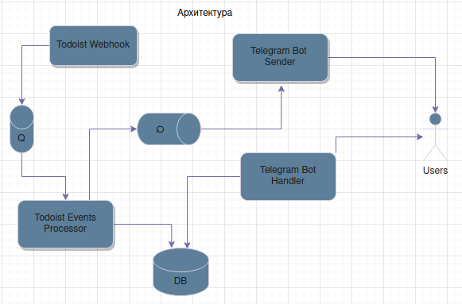
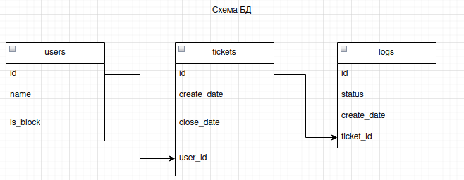

+++ 
draft        = false
title        = "Helpdesk bot"
description  = "Бот для упрощения работы техподдержки"
technologies = ["Python", "aiogram", "FastAPI", "Docker", "PostgreSQL"]
client       = "ITS"
roles        = ["Principal engineer"]
start        = "Nov 2023"
end          = "Feb 2025"
date         = 2025-05-08T08:34:09+03:00
+++

### 🧩 Problem

Organizers of major hackathons frequently contacted our team for technical support via Telegram. All issues were routed through a single support agent, creating a bottleneck and dependency on one individual.

### 💡 Solution

I initiated and led the development of an internal Telegram-based helpdesk bot, integrated with Todoist via API. The bot enabled real-time two-way communication between organizers and multiple support agents, automatically created tickets, and synchronized updates across systems.

### 🔧 Responsibilities
- Initiated the project and defined its architecture
- Assembled and managed the development team
- Implemented the infrastructure and CI/CD pipeline as lead DevOps engineer
- Designed communication flows and implemented asynchronous data handling

### 📊 Impact
- Supported 10 large-scale hackathons, including 1 national and 1 international event
- Reduced single-point-of-failure dependency by scaling the support team from 1 to 3 agents
- Improved response time and transparency for organizers
- Enabled comment-based ticket updates directly from Telegram → Todoist → back
- The bot significantly increased the support system's flexibility and responsiveness compared to traditional email-based helpdesk tools.
- Internal report based on bot DB logs & xthon platform stats

### 📈 Metrics
- Used actively for 15 months
- Processed requests from thousands of participants
- Increased internal visibility and load balancing via pull-based ticket assignment

### 🛠 Architecture & Ops
- Fully asynchronous API interactions and DB queries
- Dockerized deployment with CI/CD pipeline
- Visualized internal architecture and database schema for maintainability

